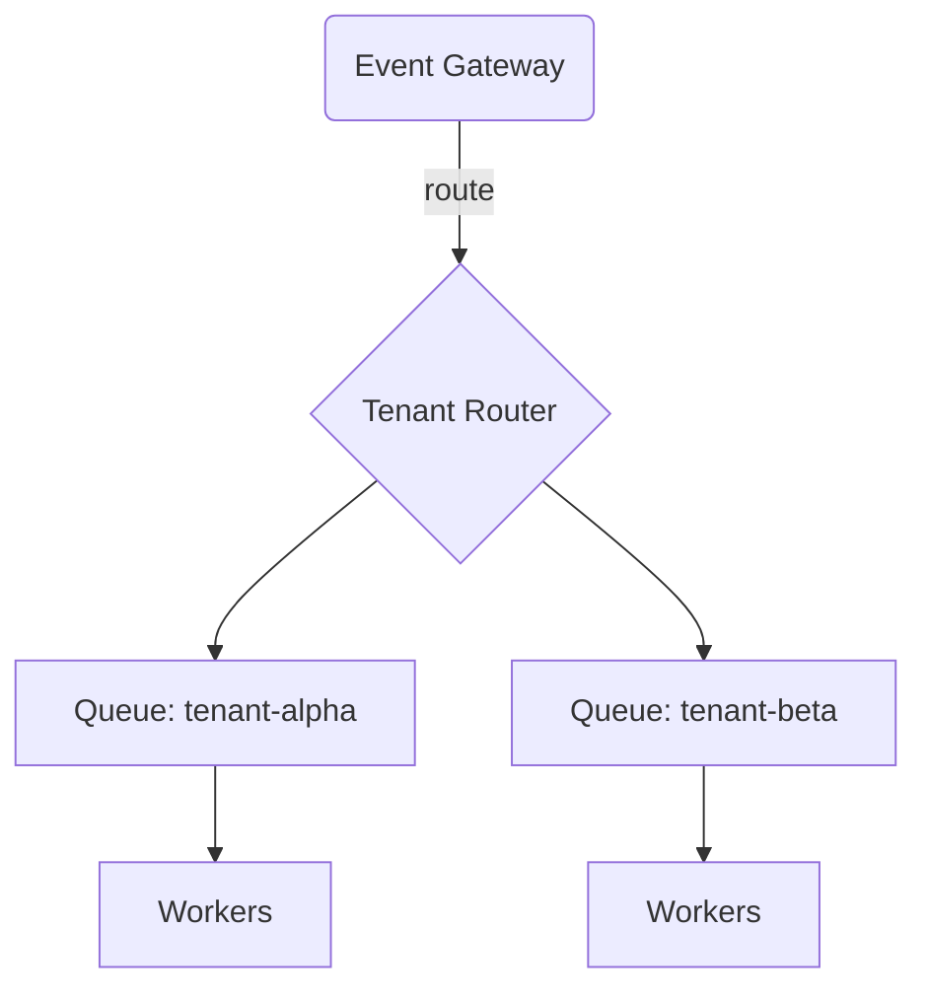

When Docxster onboarded a large enterprise client, our otherwise stable ingestion pipeline started cracking at the seams. The new customer had a penchant for firing a *lot* of webhooks in short bursts—think sixty thousand events landing in under three minutes. Our old setup used a single queue and a set of stateless workers. It looked great in diagrams, but collapsed spectacularly in production.

## Finding the cracks

The incident review quickly surfaced three failure modes:

1. **Slow consumers blocked the entire queue.** We were using a standard FIFO queue without isolation. A single long-running task starved hundreds of requests behind it.
2. **Back-pressure signals never made it to the edge.** Downstream failures were retried aggressively, causing cascading retries.
3. **Observability lied to us.** Metrics were aggregated per minute, so by the time dashboards alerted us, we were already in a death spiral.

## Strategies that worked

We landed on a solution that combined *bucketed priority queues*, *token buckets at the edge*, and *structured back-pressure*.

### 1. Per-tenant priority queues



Queues were now segmented by tenant and annotated with cost metadata. The scheduler pulled from queues round-robin style, but skipped any tenant that exceeded its cost budget. That meant a single noisy neighbor couldn’t suffocate the rest.

### 2. Adaptive token bucket

The next unlock was treating the queue as a *contract*, not a fire-and-forget buffer. Edge gateways issued tokens based on downstream health. When workers detected an issue, they published a health downgrade event. Edge nodes immediately ratcheted down the available tokens.

```ts
const MAX_BUDGET = 1200;
const downgradeThreshold = (errorRate: number) => Math.max(200, MAX_BUDGET * (1 - errorRate));
```

The result? We saw a 38% drop in API error spikes—even during the largest bursts.

### 3. Observability that told the truth

We abandoned per-minute rollups and emitted structured events instead. Every task wrote a JSON blob with latency, retry count, and originating tenant. This enabled:

- Real-time dashboards that highlighted tenants crossing thresholds.
- Replaying exact failure scenarios inside the chaos playground.
- Faster postmortem writing thanks to searchable context.

## Playbooks you can borrow

- Treat queues as **living contracts**. Publish back-pressure signals.
- Segment work along **clear blast radius boundaries** (tenant, domain, feature).
- Invest in **structured logs**—you’ll learn more than from dashboards alone.

Got questions or want to see the dashboards? Hit the terminal and type `logs` or ping me on [LinkedIn](https://www.linkedin.com/in/devanshdubey1).
